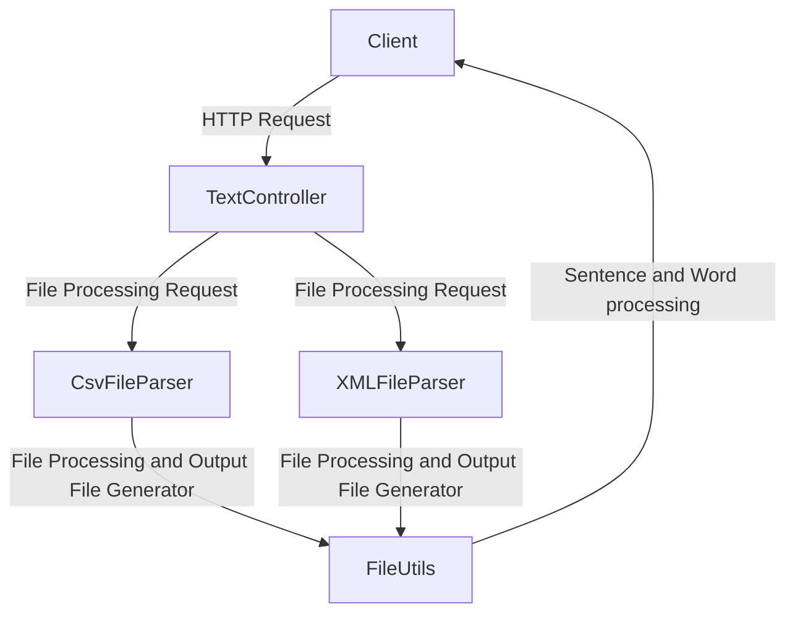

# Sample REST CRUD API with Spring Boot

## Project Name
This is a Spring Boot project that Converts text into either XML formatted data or Comma separated CSV data.

## Getting Started
To run this project, you will need to have Java installed (minimum version java 1.8). You can download it from https://www.java.com/en/download/.

## Build and Run
To build and run this project, follow these steps:

1. Start the REST API, use the command to start the server.:
    ```bash
       mvn package
       java -jar <Location of Jar file>/FileProcessorApplication-0.0.1-SNAPSHOT.jar 
    ```

2. Once started, the app will start running at <http://localhost:8080>. 

3. Send a Request with Parameters on the terminal:
    ```bash
       curl -X POST "http://localhost:8080/assignment/csvparser?file=<InputFilePath>
    ```

## Explore Rest APIs

The app defines following CRUD APIs.

    POST /assignment/xmlparser
    
    POST /assignment/csvparser


## Project Structure
In the package com.project.assignment, please find the details of classes:

1. **FileProcessorApplication** : This is the Main class, which will start the application. This class acts as the starting point for the Spring Boot framework to initialize the application context, configure beans, and begin listening for requests.
2. **TextController** : Controller Class for the application which will act as an intermediate between user and application.
3. **CsvFileParser** : CSV Service class that act as the middle layer between the controller and the model class and converting input file to CSV format.
4. **XMLFileParser** : XML Service class that act as the middle layer between the controller and the model class and converting input file to XML format.
5. **FileParser** : Creating interfaces for file conversion services.
6. **Sentence** : Model class with contains list of words and operations with respect to it.
7. **Application Constants** - This class will store all the constants being used in project.
8. **FileParameter** : This is used to maintain the file parameters for enabling batch processing of the file.
9. **FileUtils** : This class has utilities required for operating on file.

## Technologies Used
Java 21
Maven 3.9.6

## Application Overview

